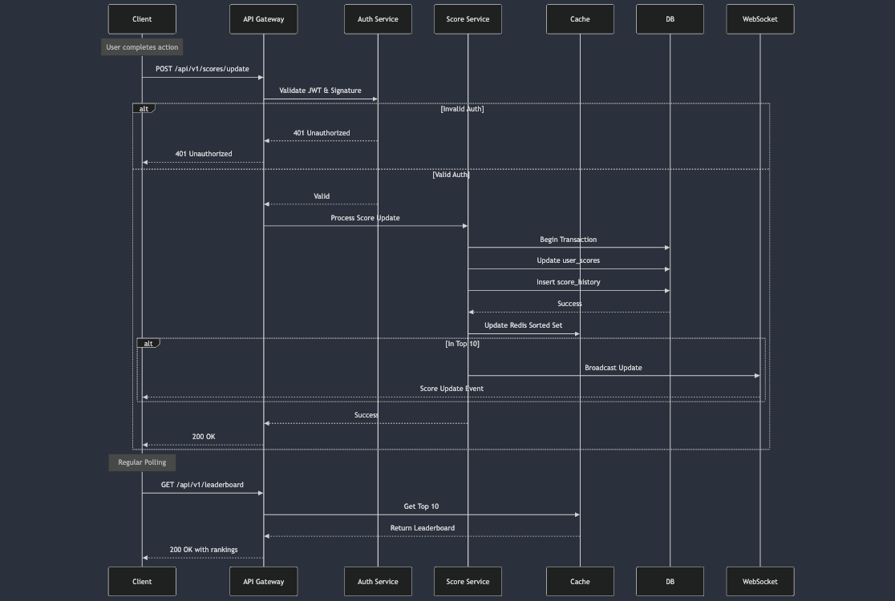

# Live Scoreboard Module Specification

## Overview
The Live Scoreboard Module is responsible for managing and updating user scores in real-time, maintaining a top 10 leaderboard, and ensuring secure score updates. This module will be part of the backend application server, providing API endpoints for score updates and real-time score synchronization.

## System Components

### 1. Score Management Service
- Handles score updates for individual users
- Validates incoming score update requests
- Maintains score history and aggregates total scores
- Updates the leaderboard cache

### 2. Authentication & Authorization
- Validates user authentication tokens
- Verifies user permissions for score updates
- Prevents unauthorized score modifications
- Rate limits score update requests

### 3. Real-time Communication
- Manages WebSocket connections for live updates
- Broadcasts score changes to connected clients
- Handles connection management and client synchronization

### 4. Caching Layer
- Maintains the current top 10 leaderboard in memory
- Provides fast access to frequently requested score data
- Ensures consistency between cache and database

## Sequence Diagram

## API Endpoints

### 1. Score Update Endpoint
```
POST /api/v1/scores/update
Authorization: Bearer {jwt_token}
Content-Type: application/json

Request Body:
{
    "actionId": string,    // Unique identifier for the action
    "timestamp": number,   // Unix timestamp of the action
    "signature": string    // HMAC signature of the request
}

Response:
{
    "success": boolean,
    "newScore": number,    // Updated total score
    "rank": number,        // Current user rank (optional)
    "error": string       // Error message if applicable
}
```

### 2. Leaderboard Endpoint
```
GET /api/v1/leaderboard
Authorization: Bearer {jwt_token}

Response:
{
    "rankings": [
        {
            "userId": string,
            "username": string,
            "score": number,
            "rank": number
        }
    ],
    "lastUpdated": number  // Unix timestamp
}
```

### 3. WebSocket Connection
```
WSS /ws/leaderboard
Authorization: Bearer {jwt_token}

Server Events:
{
    "type": "SCORE_UPDATE",
    "data": {
        "userId": string,
        "newScore": number,
        "rank": number,
        "timestamp": number
    }
}
```

## Security Measures

### Request Validation
1. JWT Authentication
   - All requests must include a valid JWT token
   - Token must contain user ID and permissions
   - Tokens expire after a configured duration

2. Action Verification
   - Each score update must include a unique actionId
   - ActionId must not have been previously processed
   - Timestamp must be within acceptable time window

3. Request Signing
   - All score update requests must be signed using HMAC
   - Signature includes actionId, timestamp, and userId
   - Server validates signature using shared secret

### Rate Limiting
1. Per-User Limits
   - Maximum of X score updates per minute
   - Maximum of Y score updates per hour
   - Configurable cool-down period between updates

2. Global Limits
   - Maximum concurrent WebSocket connections
   - Maximum score update requests per IP
   - Automatic blocking of suspicious activity

## Data Storage

### Primary Database (PostgreSQL)
```sql
-- User Scores Table
CREATE TABLE user_scores (
    user_id UUID PRIMARY KEY,
    total_score BIGINT NOT NULL DEFAULT 0,
    last_updated TIMESTAMP NOT NULL,
    action_count INTEGER NOT NULL DEFAULT 0
);

-- Score History Table
CREATE TABLE score_history (
    id UUID PRIMARY KEY,
    user_id UUID NOT NULL,
    action_id VARCHAR(64) NOT NULL UNIQUE,
    points INTEGER NOT NULL,
    timestamp TIMESTAMP NOT NULL,
    FOREIGN KEY (user_id) REFERENCES user_scores(user_id)
);

-- Create indexes
CREATE INDEX idx_scores_total ON user_scores(total_score DESC);
CREATE INDEX idx_history_timestamp ON score_history(timestamp);
```

### Redis Cache
1. Leaderboard Sorted Set
   - Key: `leaderboard:global`
   - Score: User's total score
   - Member: User ID
   - TTL: None (permanent until updated)

2. Action History Set
   - Key: `actions:user:{userId}`
   - Members: Recent actionIds
   - TTL: 24 hours

## Performance Considerations

### Caching Strategy
1. Store top 100 users in Redis (more than displayed) to handle rank changes
2. Update cache asynchronously for non-top-100 score changes
3. Implement cache warming on service startup
4. Use cache-aside pattern for leaderboard queries

### Database Optimization
1. Partition score_history table by timestamp
2. Regular cleanup of old action history
3. Implement batch updates for high-frequency changes
4. Use materialized views for complex aggregations

## Error Handling

### Score Update Failures
1. Implement retry mechanism for database updates
2. Roll back partial updates on failure
3. Log detailed error information
4. Notify monitoring system of repeated failures

### WebSocket Failures
1. Implement automatic reconnection
2. Buffer missed updates
3. Provide full state sync on reconnection
4. Handle connection timeouts gracefully

## Monitoring & Logging

### Metrics to Track
1. Score update latency
2. WebSocket connection count
3. Cache hit/miss ratio
4. Error rates by type
5. Rate limit violations

### Logging Requirements
1. All score updates with actionId
2. Authentication failures
3. Rate limit violations
4. Cache inconsistencies
5. WebSocket connection events

## Future Improvements
1. Support for multiple leaderboard categories
2. Historical leaderboard snapshots
3. Regional leaderboards
4. Achievement system integration
5. Score multiplier events
6. Social features (friend leaderboards)
7. Anti-cheat detection system
8. Score verification through game replay

## Implementation Considerations

### Scale Considerations
1. Implement message queue (e.g., RabbitMQ, Apache Kafka) for handling high-volume score updates
2. Add horizontal scaling capability for the WebSocket service
3. Implement database sharding strategy for handling massive user bases

### Security Enhancements
1. Implement OAuth2 for more flexible authentication
2. Add request encryption for sensitive data
3. Implement IP-based geofencing if required
4. Add fraud detection system based on machine learning

### Performance Optimizations
1. Use Protocol Buffers instead of JSON for WebSocket messages
2. Implement connection pooling for database connections
3. Add edge caching for leaderboard data
4. Consider implementing GraphQL for more flexible data fetching

### Resilience
1. Implement circuit breakers for external service calls
2. Add fallback mechanisms for cache failures
3. Implement dead letter queues for failed updates
4. Add automated failover for database

### Operational
1. Add OpenTelemetry integration for better observability
2. Implement automated backup and recovery procedures
3. Add chaos testing scenarios
4. Create runbooks for common operational issues

## Development Guidelines
1. Follow RESTful API best practices
2. Implement comprehensive unit tests
3. Use database transactions for atomic updates
4. Document all API changes in OpenAPI format
5. Follow semantic versioning for API changes